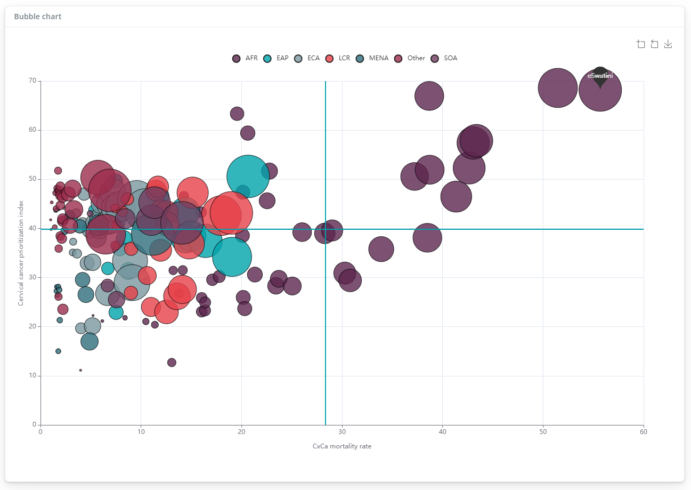
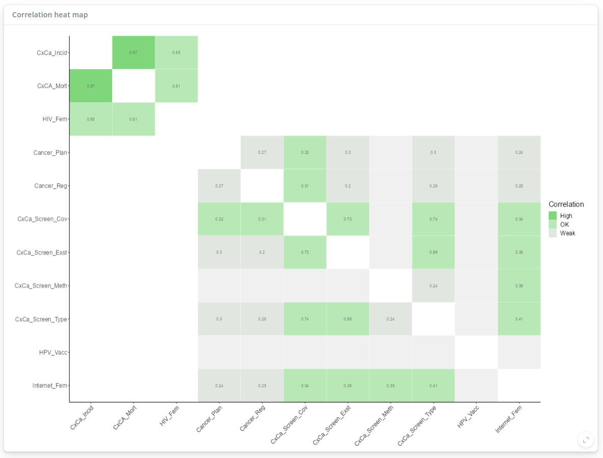
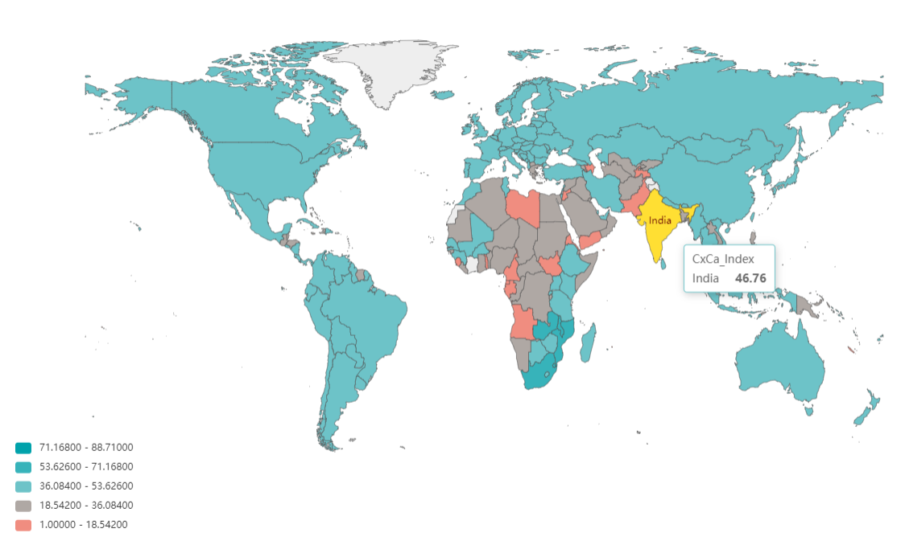
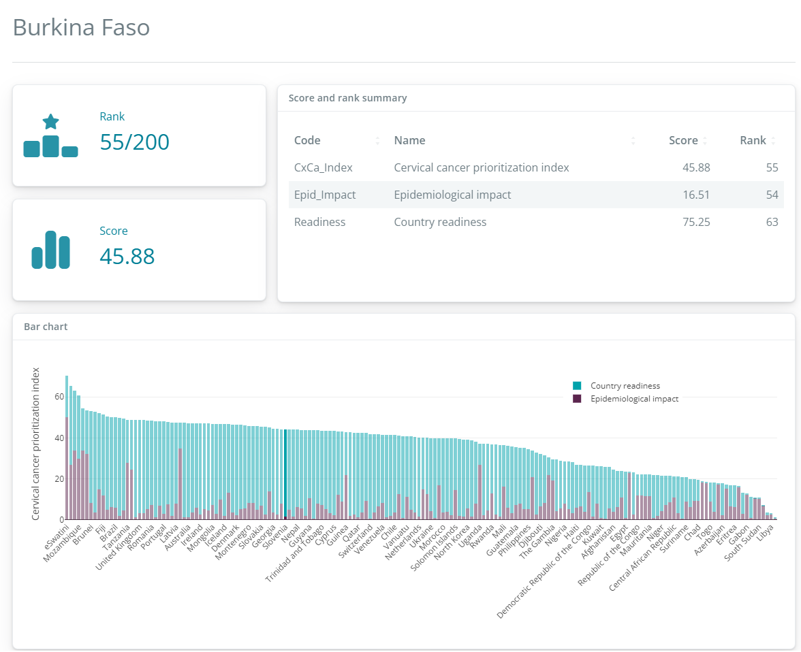

# {composer}

The {composer} package is a Shiny app which provides an easy interface for building composite indicators using any data set. Users can visualise and explore results in depth, and download figures and reports.










:blue_book: Full documentation for the package and app is available at <https://finddx.github.io/composer/>

At the moment, in order to run the app you will have to have R installed, then first install the package:

```{r}
#| eval: false

# install package if not already installed
remotes::install_github("finddx/composer")
```

To run the app you then have to run:

```{r}
#| eval: false

# load package
library(composer)

# run app
run_gui()
```

As a Shiny app, the app will open in your web browser and acts as an interactive GUI.

# About

Composite indicators are aggregations of multiple indicators into a single composite score. They are typically used to measure multidimensional socio-economic concepts such as innovation, quality of life, and so on. Often they are used to rank and compare countries and regions, either for advocacy or for prioritisation or to help direct the resources of international organisations.

The [COINr](https://github.com/bluefoxr/COINr) package is an R package designed to help build and analyse composite indicators. The objective of this repo is to develop a Shiny app which provides a user-friendly interface with the COINr package, allowing non-R users to build and visualise composite indicators.

## Features

The {composer} app includes the following features:

-   Any number of indicators and units and aggregation levels
-   Unit screening by data availability
-   Missing data imputation
-   Outlier treatment
-   Normalisation using various methods
-   Weighted aggregation
-   Interactive maps (if the units are countries)
-   Detailed analysis of indicators using bubble charts, bar charts
-   Statistical analysis using visualisation of distributions, correlation plots
-   Downloadable unit profiles
-   Interactive reweighting
-   Sensitivity analysis on assumptions, checking the effects of removing indicators and indicator groups

## Methodology

The composite indicator methodology used in this app follows the internationally-recognised [OECD/JRC Handbook of Composite Indicators](https://publications.jrc.ec.europa.eu/repository/handle/JRC47008), and the methodology used by the [European Commission](https://knowledge4policy.ec.europa.eu/composite-indicators_en).

Most of the data processing in the app is done using the [COINr package](https://bluefoxr.github.io/COINr/), which is an R package for building and analysing composite indicators. R users may wish to additionally work with COINr directly to access functionalities not included in the app.

## Development and contribution

{composer} was developed over 2023-2024 and (at the time of writing in Feb 2024) is in an early release phase. If you find a bug in the app, or have a feature request, please [open an issue on GitHub](https://github.com/finddx/composer/issues). Collaboration and contribution are welcome: if you wish to contribute please fork the GitHub repo, make any changes and make a pull request. Feel free to discuss on the issues page, or [contact us](mailto:william.becker@bluefoxdata.eu).

## Acknowledgements

{composer} was originally built as an internal-use app for the [Foundation for Innovative New Diagnostics](https://www.finddx.org/) (FIND), who then kindly granted permission for an open-source release. The app is effectively a front end for the [COINr](https://bluefoxr.github.io/COINr/) package, and also benefits from many other open-source R packages.
